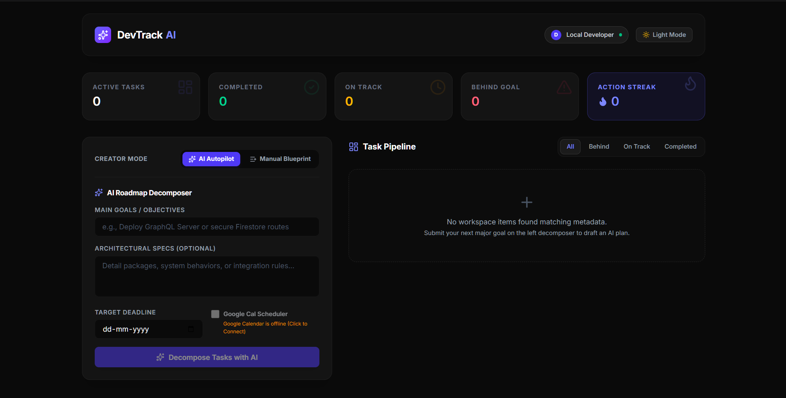

<div align="center">

</div>
<div align="center">

# 🎯 DevTrack AI

### An autonomous AI productivity companion that doesn't just remind you — it makes sure you finish.

**Built for [Vibe2Ship](https://blockseblock.com/hackathon_details/Vibe2Ship) by BlocksEBlock**
Track: **"The Last-Minute Life Saver"**

[](https://ai.google.dev/)
[](https://react.dev/)
[](https://www.typescriptlang.org/)
[](https://firebase.google.com/)
[](https://vitejs.dev/)

[View Live on AI Studio](https://ai.studio/apps/ea989cad-a088-48d7-8d58-4745e14c6119) · [Report a Bug](../../issues) · [Request a Feature](../../issues)

</div>

<br/>

<div align="center">
  
</div>

<br/>

## 📌 The Problem

Students, professionals, and entrepreneurs constantly miss deadlines, assignments, and commitments — not because they don't have reminders, but because **passive reminders are easy to ignore**. A notification that says "due tomorrow" doesn't help anyone actually *start*.

## 💡 The Solution

**DevTrack AI** is a full-stack productivity workspace that turns a single goal into a concrete execution plan, then actively watches over it. Instead of one more notification you'll swipe away, DevTrack AI:

1. **Decomposes** a high-level goal into a realistic, prioritized roadmap using Gemini.
2. **Schedules** that roadmap directly onto your Google Calendar.
3. **Monitors** your real progress against your deadline in the background — autonomously, with no user action required.
4. **Intervenes** the moment you start falling behind, with a personalized, context-aware nudge that names the exact subtask you're stuck on.

It's the difference between a calendar that tells you a deadline exists, and a coach that notices you're behind and tells you exactly what to do next.

---

## ✨ Key Features

### 🧠 AI Roadmap Decomposer
- **Creator Mode** toggle — **AI Autopilot** (goal + optional architectural specs + deadline) or **Manual Blueprint** (hand-authored roadmap) for full control.
- Gemini returns 3–6 logical subtasks, a priority (`High` / `Medium` / `Low`), a realistic time estimate, a single concrete **First Step**, and a 3-step **Start Now Plan** of sub-5-minute actions designed to break procrastination inertia.

### 🤖 Autonomous Monitoring & Proactive Nudging
- A server-side scheduler periodically re-evaluates every task in Firestore — **with no user request needed** — and flags it `Behind` if it's overdue, more than halfway through its timeline with under 35% progress, or within 24 hours of deadline with under 70% progress.
- For every flagged task, Gemini autonomously writes a short, personal nudge that names the user's actual unfinished subtask, and writes it straight back into Firestore.

### 📅 Google Calendar Integration
- One-click Google Sign-In requests Calendar scopes; subtasks can be pushed as real calendar events with full task context in the description.
- Completing a subtask syncs its calendar event automatically; removing a subtask cleans up its event too.

### 📊 Task Pipeline Dashboard & Action Streak
- Live counters for **Active**, **Completed**, **On Track**, and **Behind Goal** tasks.
- An **Action Streak** metric that tallies completed subtasks across every roadmap to reward daily momentum.
- Filterable pipeline view (`All` / `Behind` / `On Track` / `Completed`).

### 🎯 Focus Mode
- A fullscreen, distraction-free overlay for working through one roadmap's subtasks at a time.

### 🛡️ Resilient AI Pipeline
- Automatic retry with exponential backoff + jitter, and a three-model fallback chain (`gemini-3.5-flash` → `gemini-flash-latest` → `gemini-3.1-flash-lite`) so transient rate limits never break the demo.
- A deterministic local fallback generator produces a sensible breakdown and nudge even with no API key configured — the app is always demoable.

---

## 🧰 Tech Stack

| Layer | Technology |
|---|---|
| **Frontend** | React 19, TypeScript, Tailwind CSS v4, Vite, Lucide React, Motion |
| **Backend** | Node.js, Express, served via Vite middleware (dev) / static build (prod) |
| **AI** | Google Gemini API (`@google/genai`) — structured JSON schema output for task decomposition, free-form generation for nudges |
| **Auth** | Firebase Authentication — Google Sign-In with Calendar OAuth scopes |
| **Database** | Cloud Firestore (real-time tasks, subtasks, progress, nudges) |
| **Scheduling** | Firebase Admin SDK — autonomous background scheduler |
| **Calendar** | Google Calendar API — create / update / delete events per subtask |
| **Build/Deploy** | Google AI Studio (Build Mode), esbuild, TypeScript |

### Google Technologies Utilized
- **Google Gemini API** — task decomposition, prioritization, time estimation, and proactive nudge generation
- **Firebase Authentication** — Google OAuth sign-in with delegated Calendar access
- **Cloud Firestore** — real-time data layer
- **Firebase Admin SDK** — server-side autonomous scheduler
- **Google Calendar API** — two-way subtask ↔ calendar event sync
- **Google AI Studio (Build Mode)** — built and deployed end-to-end

---

## 🏗️ Architecture

```
┌──────────────────┐      ┌──────────────────────┐      ┌──────────────────┐
│   React Client    │◄────►│  Express API Server  │◄────►│  Google Gemini   │
│  (Vite + Tailwind) │      │   (server.ts)         │      │       API        │
└─────────┬─────────┘      └──────────┬───────────┘      └──────────────────┘
          │                            │
          ▼                            ▼
┌──────────────────┐      ┌──────────────────────┐
│ Firebase Auth /    │      │  Firestore + Admin    │──── every 15 min ────►  scans tasks,
│  Calendar OAuth     │      │  SDK (background       │                          flags "Behind",
└──────────────────┘      │  scheduler)             │                          generates nudge
                            └──────────────────────┘
```

A single Express process serves the Vite-built React app **and** the `/api/generate-task` / `/api/generate-nudge` Gemini endpoints, while a `setInterval` background job continuously audits Firestore for tasks that need a nudge — no separate cron infra required.

---

## 🚀 Getting Started

### Prerequisites
- [Node.js](https://nodejs.org/) (v18+ recommended)
- A [Gemini API key](https://ai.google.dev/) (free tier works)
- A Firebase project with **Authentication** (Google provider) and **Firestore** enabled

### 1. Clone & Install
```bash
git clone https://github.com/<your-username>/devtrack-ai.git
cd devtrack-ai
npm install
```

### 2. Configure Environment
Copy `.env.example` to `.env.local` and add your Gemini API key:
```bash
GEMINI_API_KEY="your-gemini-api-key"
APP_URL="http://localhost:3000"
```

You'll also need a `firebase-applet-config.json` in the project root with your Firebase project's web config (`apiKey`, `projectId`, `firestoreDatabaseId`, etc.) — this powers both the client SDK and the Firebase Admin scheduler.

### 3. Run Locally
```bash
npm run dev
```
The app runs on **http://localhost:3000**, with Vite middleware serving the React client and Express handling the AI/API routes from the same process.

### 4. Build for Production
```bash
npm run build
npm run start
```

---

## 📁 Project Structure

```
devtrack-ai/
├── server.ts                # Express API + Gemini calls + autonomous scheduler
├── src/
│   ├── App.tsx               # Main UI — dashboard, decomposer, pipeline, focus mode
│   ├── main.tsx               # React entry point
│   ├── types.ts                # Task / Subtask interfaces
│   └── lib/
│       ├── firebase.ts          # Auth, Firestore init, Calendar OAuth scopes
│       └── calendar.ts           # Google Calendar event create/update/delete
├── firestore.rules           # Firestore security rules
├── firebase.json              # Firebase project config
└── .env.example               # Required environment variables
```

---

## 🗺️ Future Roadmap

Beyond this hackathon build, the problem statement's full vision includes:
- 🎙️ Voice-enabled assistance for hands-free task capture
- 📈 Long-term goal and habit tracking, not just deadline-bound tasks
- 📱 A native mobile companion for on-the-go nudges
- 🔁 Two-way calendar sync (detecting manual edits made directly in Google Calendar)

---

## 👤 Author

**Sridev** — BCA Student, Sister Nivedita University, Kolkata
GitHub: [@sridevbaag](https://github.com/sridevbaag) · Portfolio: [sridevbaag.github.io](https://sridevbaag.github.io)

---

<div align="center">
<sub>Built with ❤️ and a healthy fear of deadlines, for the Vibe2Ship hackathon by BlocksEBlock.</sub>
</div>
